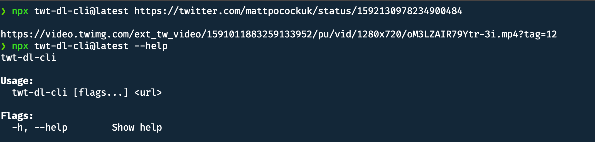

# Welcome to twt-dl-cli 👋

<!-- ALL-CONTRIBUTORS-BADGE:START - Do not remove or modify this section -->
[](#contributors-)
<!-- ALL-CONTRIBUTORS-BADGE:END -->

[](https://www.npmjs.com/package/twt-dl-cli)
[](#)
[](https://twitter.com/jellydn)

> Download videos and photos from Twitter/X tweet URLs with the CLI.

Inspired by [egoist/download-twitter-video: The easiest way to download any Twitter video](https://github.com/egoist/download-twitter-video).

[![IT Man - Tip #29 - How I create download Twitter URL with ChatGPT [Vietnamese]](https://i.ytimg.com/vi/jiC7EmKT64U/hqdefault.jpg)](https://www.youtube.com/watch?v=jiC7EmKT64U)

## Install

```sh
npm install -g twt-dl-cli@latest
```

## Built with

- [jellydn/typescript-starter: Typescript starter project](https://github.com/jellydn/typescript-starter)
- [privatenumber/cleye: 👁‍🗨 cleye — The intuitive & typed CLI development tool for Node.js](https://github.com/privatenumber/cleye)
- [kevva/download: Download and extract files](https://github.com/kevva/download)
- [sindresorhus/ora: Elegant terminal spinner](https://github.com/sindresorhus/ora)
- And ChatGPT :)


## Usage

```sh
npx twt-dl-cli@latest --help
```

### Example:

```sh
npx twt-dl-cli@latest https://twitter.com/mattpocockuk/status/1592130978234900484
```

### Download a Thread (Multiple URLs):

Pass multiple URLs to download videos/photos from several tweets. For a thread, supply each tweet URL; the CLI does not discover thread replies automatically.

```sh
npx twt-dl-cli@latest https://twitter.com/user/status/123 https://twitter.com/user/status/456
```



If a URL fails, the CLI reports it and continues with later URLs. The final exit code is 1 if any URL fails, or 0 if all URLs succeed. A tweet with no media is not a failure.

### Library API

`downloadVideo(url)` now returns `Promise<string[]>`, not a single URL or `undefined`. It returns all media URLs for one tweet, or an empty array when the tweet has no media.

`downloadFile(mediaUrl, outputFile?)` returns `Promise<WriteStream>` only after the file finishes writing. It rejects on download or write errors. Without `outputFile`, it uses a unique filename in the current directory. An explicit output path is preserved and overwrites an existing file.

## Author

👤 **Huynh Duc Dung**

- Website: https://productsway.com/
- Twitter: [@jellydn](https://twitter.com/jellydn)
- Github: [@jellydn](https://github.com/jellydn)

## Show your support

Give a ⭐️ if this project helped you!

[](https://ko-fi.com/dunghd)
[](https://paypal.me/dunghd)
[](https://www.buymeacoffee.com/dunghd)

## Contributors ✨

Thanks goes to these wonderful people ([emoji key](https://allcontributors.org/docs/en/emoji-key)):

<!-- ALL-CONTRIBUTORS-LIST:START - Do not remove or modify this section -->
<!-- prettier-ignore-start -->
<!-- markdownlint-disable -->
<table>
  <tbody>
    <tr>
      <td align="center" valign="top" width="14.28%"><a href="https://productsway.com/"><br /><sub><b>Dung Duc Huynh (Kaka)</b></sub></a><br /><a href="https://github.com/jellydn/twt-dl-cli/commits?author=jellydn" title="Code">💻</a> <a href="https://github.com/jellydn/twt-dl-cli/commits?author=jellydn" title="Documentation">📖</a></td>
      <td align="center" valign="top" width="14.28%"><a href="https://github.com/yetone"><br /><sub><b>yetone</b></sub></a><br /><a href="https://github.com/jellydn/twt-dl-cli/commits?author=yetone" title="Code">💻</a></td>
      <td align="center" valign="top" width="14.28%"><a href="http://devosfera.vercel.app"><br /><sub><b>Andrés Ujpán</b></sub></a><br /><a href="https://github.com/jellydn/twt-dl-cli/commits?author=0xdres" title="Code">💻</a> <a href="https://github.com/jellydn/twt-dl-cli/commits?author=0xdres" title="Documentation">📖</a></td>
    </tr>
  </tbody>
</table>

<!-- markdownlint-restore -->
<!-- prettier-ignore-end -->

<!-- ALL-CONTRIBUTORS-LIST:END -->

This project follows the [all-contributors](https://github.com/all-contributors/all-contributors) specification. Contributions of any kind welcome!

Contributor records are stored in `.all-contributorsrc`; the badge and table above are generated from those records. Keep the existing records when updating the table.

To recognize a confirmed contribution, comment on an issue or pull request with `@all-contributors please add @USERNAME for CONTRIBUTION_TYPE`. Replace the placeholders with the contributor's GitHub login and the types from the [emoji key](https://allcontributors.org/docs/en/emoji-key). Do not add unverified contributions.

A repository owner must [install the All Contributors GitHub App](https://github.com/apps/allcontributors) for this repository if the bot does not respond. As a local alternative, run `pnpm dlx all-contributors-cli generate` to regenerate the README from the existing configuration, then review the diff before committing.
